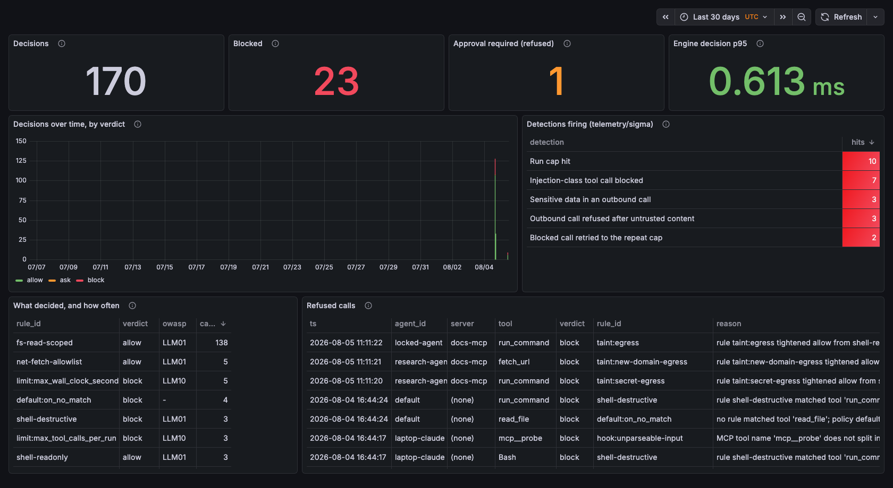

# telemetry — decision events and detections

Every decision emits one structured event: timestamp, agent id, tool, redacted args, verdict, rule id, latency.

This is the least glamorous directory and the one that matters most to anyone who would have to operate this at 3am. Building a blocker is easy; shipping detections for your own control is what makes it operable.

**Done when:** a stranger can read the schema and write their own detection without asking a question.

## What is here

| Path | What it is |
|---|---|
| [`event-schema.json`](event-schema.json) | The published, versioned event schema. The contract a detection is written against. |
| [`sigma/`](sigma) | Sigma rules, one per abuse pattern, each proven to fire on real events and *not* to fire on the benign neighbour. |
| [`samples/`](samples) | Real event streams, produced by real runs — not hand-written. Test your detection against these before you deploy it, but read the timing caveat below first. |
| [`dashboard/`](dashboard) | The dashboard: off-the-shelf Grafana over off-the-shelf Postgres, provisioned from these files. No UI code. |
| [`dashboard.png`](dashboard.png) | The screenshot, also embedded in the top-level README. |

## Where the events come from

Both enforcement points write the same key set, one JSON object per line:

```sh
# the proxy — to its own file, not to stderr (D-024)
python -m proxy --policy policy/policy.example.yaml \
  --agent-id demo --log-file /sandbox/decisions.jsonl -- <upstream command...>

# the hook — --log-file or $CHOKEPOINT_LOG
python hooks/chokepoint_hook.py --policy policy/policy.example.yaml \
  --log-file /var/log/chokepoint/decisions.jsonl
```

The deployed gateway passes `--log-file` at `<sandboxPath>/decisions.jsonl`. That is deliberate: the proxy's *stderr* is shared with the upstream child process, so a collector parsing stderr as JSONL meets non-JSON lines. The file carries events and nothing else.

### A timing caveat on the samples, found by testing them

Every event in `samples/` is real, but **time is compressed in the cap scenarios**, and a time-windowed detection can behave differently against them than against production. `proxy-wall-clock-cap.jsonl` reproduces B-040's condition — a healthy run whose allowed traffic turns into 100% `limit:max_wall_clock_seconds` refusals — by setting the cap to 3 seconds, so the whole run spans **2.4 seconds** where the real incident spanned 900. A rule asking "were *all* of this run's calls in the last 60s refused?" is correct for the incident and correctly declines to fire on the sample, because the sample's earlier allows are still inside that same 60-second window.

This was measured, not guessed: a detection engineer with no access to this repo wrote exactly that rule from the schema alone, and it returned nothing here for exactly that reason. If your detection is time-windowed, either widen the window past the sample's span or rebase the sample timestamps before drawing a conclusion. Every detection below is keyed on the event rather than on a window, so all of them are unaffected.

`proxy-taint.jsonl` compresses nothing — it is three ordinary runs, one per `egress_mode` — but read it with the same care for a different reason: which of the three `taint:` ids a deployment can emit *at all* is decided by its configured mode, and the mode is not on the event. All three appear in that file because it was produced under all three.

## The detections

Each rule in [`sigma/`](sigma) states its own logic; what matters here is that **none of them is asserted**. `tests/test_telemetry_controls.py` generates real events by driving the real chain, converts each rule with pySigma's own sqlite backend, runs the resulting SQL, and checks both directions:

| Rule | Fires on | The benign neighbour it must not fire on |
|---|---|---|
| `chokepoint-injection-triggered-call` | a block carrying an `owasp` mapping — a rule the policy author wrote | deny-by-default noise (`default:on_no_match`, whose `owasp` is null), and allowed LLM01 calls |
| `chokepoint-sensitive-egress-attempt` | an LLM02 block, or any call whose arguments were redacted | the same tool to the same allowlisted domain without a secret |
| `chokepoint-blocked-then-retry-loop` | `limit:max_repeated_identical_calls` | the earlier refusals of that same call, below the repeat threshold |
| `chokepoint-rate-cap-hit` | any `limit:` cap | the pre-cap allows in the same run |
| `chokepoint-taint-egress-refusal` | any `taint:` id — an outbound call refused because the run had read untrusted content | the IDENTICAL call earlier in the same session, before the run was marked |

A rule that has never fired on a real event is exactly as vacuous as a NetworkPolicy on a CNI that does not enforce it (D-021). That is why the controls run in the suite rather than in a comment.

**The last two rows overlap on purpose, and the overlap is measured rather than described.** Every `taint:` refusal carries `owasp: LLM01`, so `chokepoint-injection-triggered-call` fires on it too — and that rule's title says *injection*, which a taint refusal is not: nothing inspected the consumed content, the run is marked on the SOURCE tool, and under `egress_mode: all_egress` a bare `pwd` lands there. Narrowing the injection rule to exclude them was considered and rejected: a taint refusal **is** LLM01-class enforcement, and dropping it from the LLM01 view would lose signal to fix a headline. So both rules fire, the injection rule tells the reader to read the `rule_id` before the title, and `chokepoint-taint-egress-refusal` carries the alert text the schema prescribes. `test_injection_rule_fires_on_llm01_blocks_and_nothing_else` asserts the overlap explicitly, so it cannot quietly stop being true.

## The dashboard



**The screenshot is current with the provisioning files again.** It was retaken on 2026-08-05, against every stream in `samples/`, and it now shows the taint detection row that the 2026-08-04 capture predated. Retaking it is the only way it ever changes: it is a measurement, replaced by a newer run and never edited to agree with a file. If you add a stream or a rule and do not retake it, say so here — the previous capture carried exactly that note for a day, and the note is what kept the gap honest.

Run it against the committed samples, or against a real gateway's `decisions.jsonl`:

```sh
cd telemetry/dashboard
export CHOKEPOINT_PG_PASSWORD="$(openssl rand -hex 16)"   # no credential is committed
docker compose up -d
python3 load_events.py ../samples/*.jsonl | docker compose exec -T postgres \
  psql -q -U chokepoint -d chokepoint
open http://127.0.0.1:3001/d/chokepoint-decisions
```

The detection panel embeds the SQL each Sigma rule converts to, **verbatim**, and `tests/test_telemetry_controls.py::test_the_dashboard_detection_panel_matches_the_sigma_rules` fails if the panel and the rule ever disagree — so the dashboard cannot quietly drift away from the shipped detections.

## Running the controls

`jsonschema` and `sigma-cli` are development tools, not dependencies of this project, so the telemetry tests skip when they are absent (the same shape as the cluster-gated acceptance test):

```sh
.venv/bin/pip install jsonschema sigma-cli pysigma-backend-sqlite
.venv/bin/python -m pytest tests/test_telemetry_controls.py -v
```
